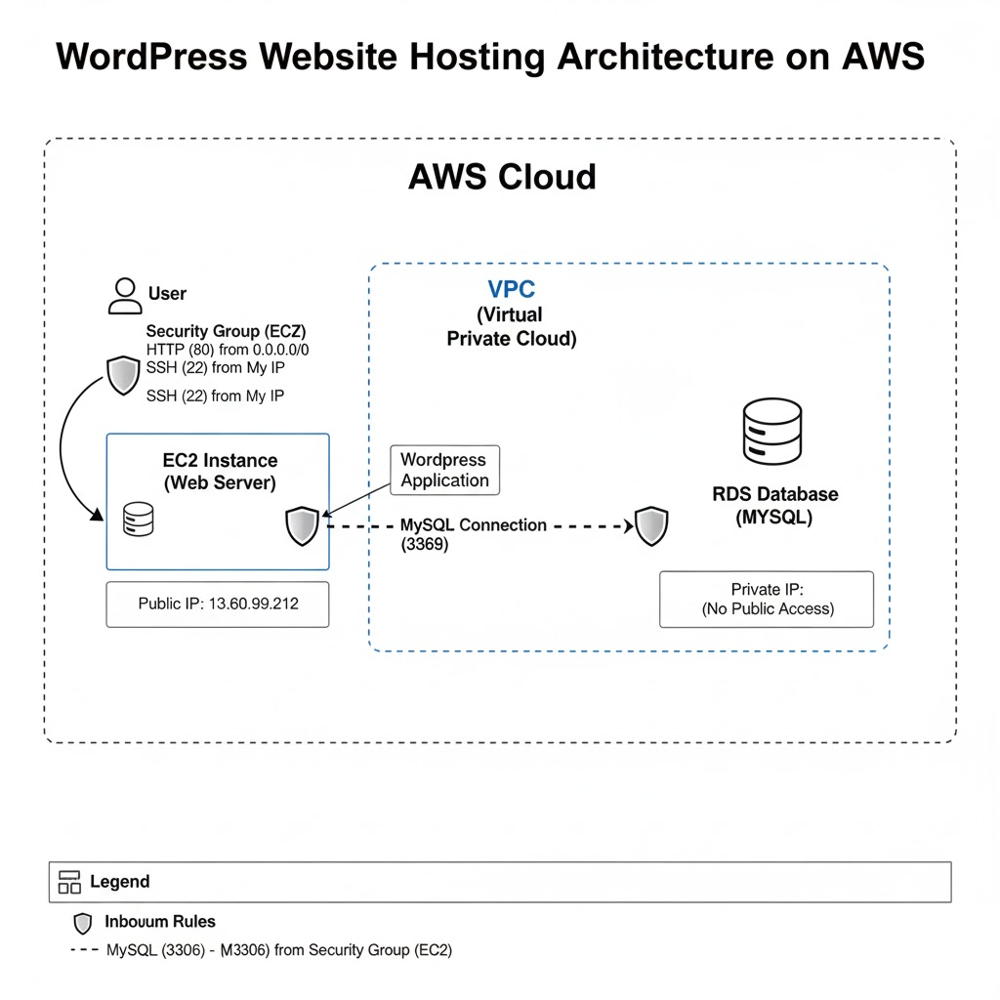
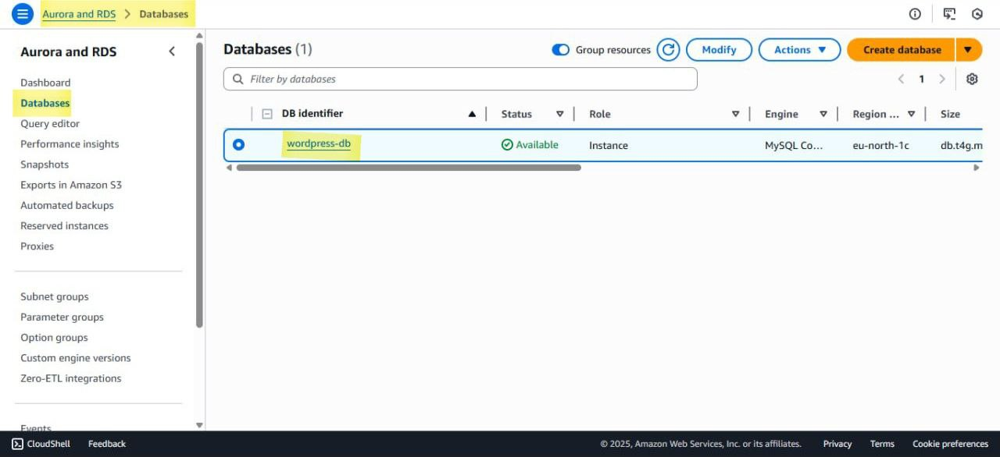
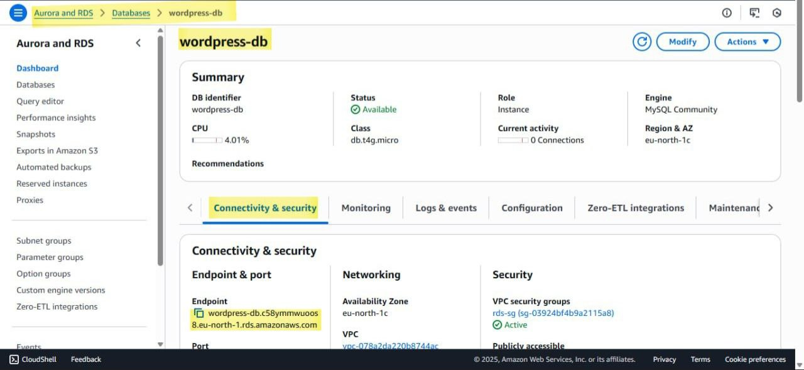
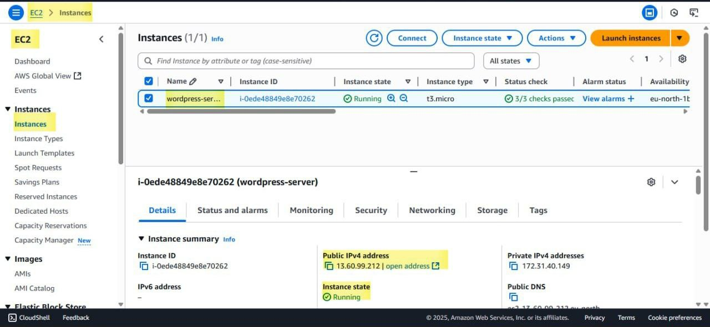
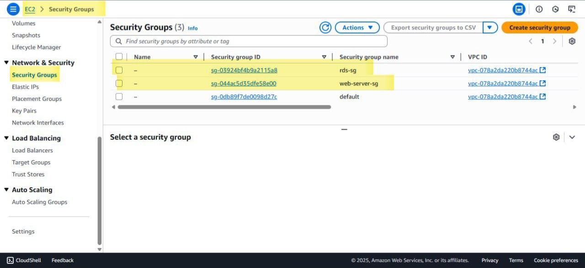
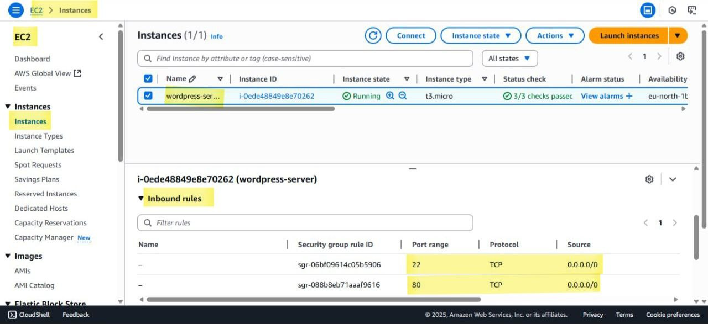
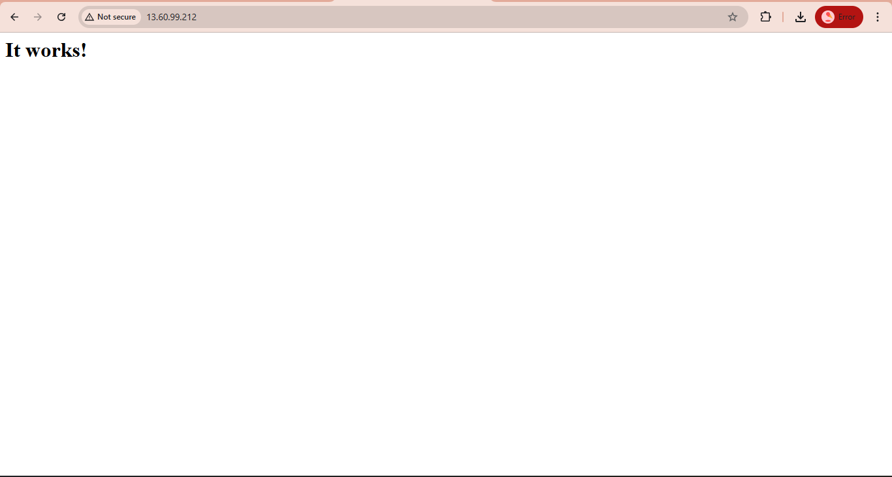

# aws-wordpress-hosting-project
Deploying a dynamic WordPress website on AWS using EC2 for compute and RDS for a managed database.

# Project: Deploying a Dynamic WordPress Site on AWS IaaS

This project demonstrates the process of building and deploying a dynamic web application (a WordPress blog) on Amazon Web Services (AWS), utilizing core Infrastructure as a Service (IaaS) components. The architecture is designed to be secure, scalable, and resilient by decoupling the web server from the database.

---

### 🏛️ Project Architecture

The infrastructure was designed within a Virtual Private Cloud (VPC) to ensure network isolation. The EC2 web server is placed in a public subnet to receive traffic from the internet, while the RDS database is in a private subnet, inaccessible from the public internet and only reachable by the EC2 instance, maximizing security.

---

### 🛠️ Services Used

* **Amazon EC2 (Elastic Compute Cloud):**
    * **Role:** Served as the virtual web server (`t2.micro` instance type).
    * **Configuration:** A LAMP stack (Linux, Apache, MySQL Client, PHP) was installed and configured to host the WordPress application files.

* **Amazon RDS (Relational Database Service):**
    * **Role:** Provided a fully managed MySQL database instance.
    * **Benefits:** This approach offloads database management tasks such as patching, backups, and scaling, allowing focus on the application layer.

* **Amazon VPC (Virtual Private Cloud):**
    * **Role:** Provided a secure and isolated network environment for all AWS resources.

* **Security Groups:**
    * **Role:** Acted as a stateful virtual firewall to control inbound and outbound traffic for the EC2 instance and RDS database.
    * **Web-Server-SG:** Configured to allow inbound `HTTP` traffic (port 80) from `Anywhere (0.0.0.0/0)` and `SSH` traffic (port 22) from my personal IP for secure management.
    * **RDS-SG:** Configured to allow inbound `MySQL` traffic (port 3306) **only** from the `Web-Server-SG`, effectively isolating the database from the public internet.
    * 

---

### 🧗 Challenges & Solutions (Problem-Solving)

During this project, I encountered several real-world technical challenges and successfully resolved them:

1.  **`ERR_CONNECTION_TIMED_OUT` on Initial Access:**
    * **Challenge:** The browser could not reach the web server, even though the EC2 instance was running.
    * **Solution:** I diagnosed the issue by inspecting the EC2 instance's Security Group. I discovered that the inbound rule to allow `HTTP` traffic on port `80` was missing. By adding this rule, I successfully allowed web traffic to reach the server.

2.  **SSH Key Permissions Error on Windows:**
    * **Challenge:** The SSH client on Windows refused to use the `.pem` key file, citing that its permissions were too open.
    * **Solution:** I learned how to properly secure the key file by modifying its permissions using PowerShell (`icacls`) to restrict access to only my user account, which satisfied the SSH client's security requirements.

3.  **WordPress "Error Establishing a Database Connection":**
    * **Challenge:** After installation, WordPress was unable to communicate with the RDS database.
    * **Solution:** I troubleshooted this by verifying two key areas:
        * **Networking:** I confirmed that the RDS Security Group was correctly configured to accept inbound traffic from the EC2's Security Group on port `3306`.
        * **Configuration:** I meticulously checked the `wp-config.php` file for typos and ensured the database endpoint, username, and password were correct.

---

### 📸 Project Screenshot

*If you have a screenshot, leave this section. If not, you can delete it.*

